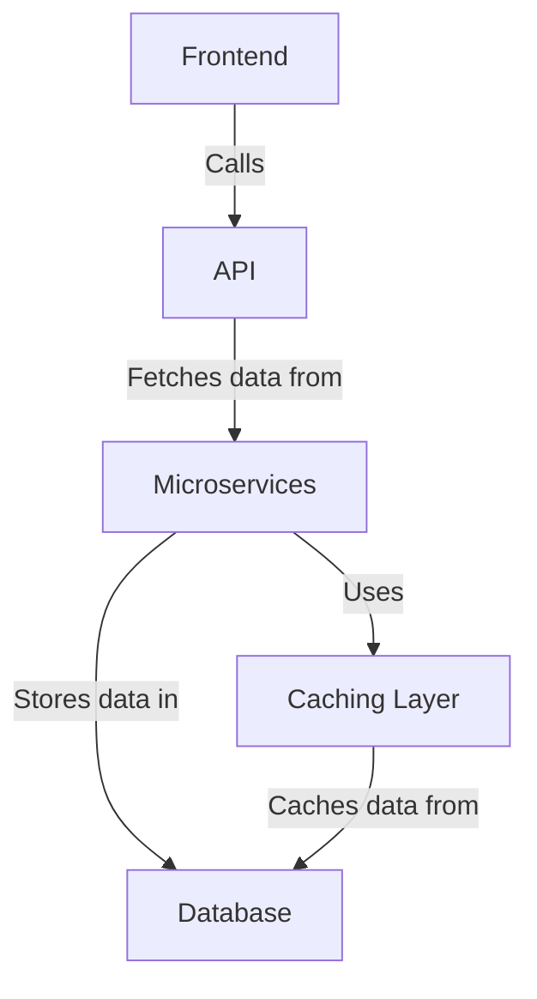

# Software Architecture Overview

This document provides an overview of the software architecture, including the frontend, API, microservices, database, and caching layers.

```mermaid
flowchart TD
    A[Frontend] -->|Calls| B[API]
    B -->|Fetches data from| C[Microservices]
    C -->|Stores data in| D[Database]
    C -->|Uses| E[Caching Layer]
    E -->|Caches data from| D
```
